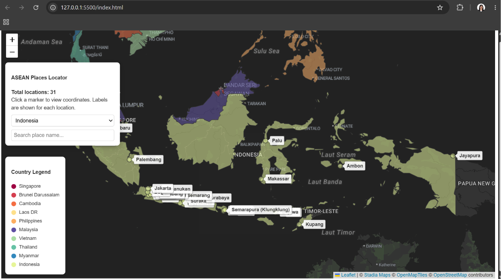
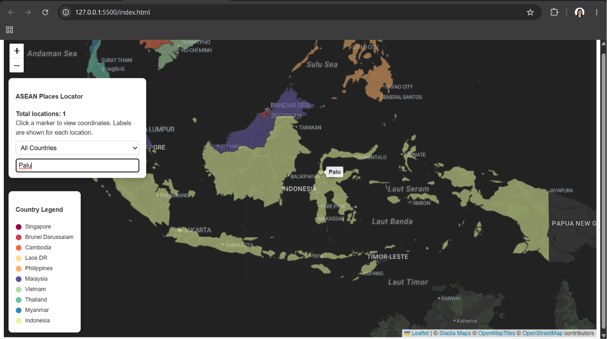
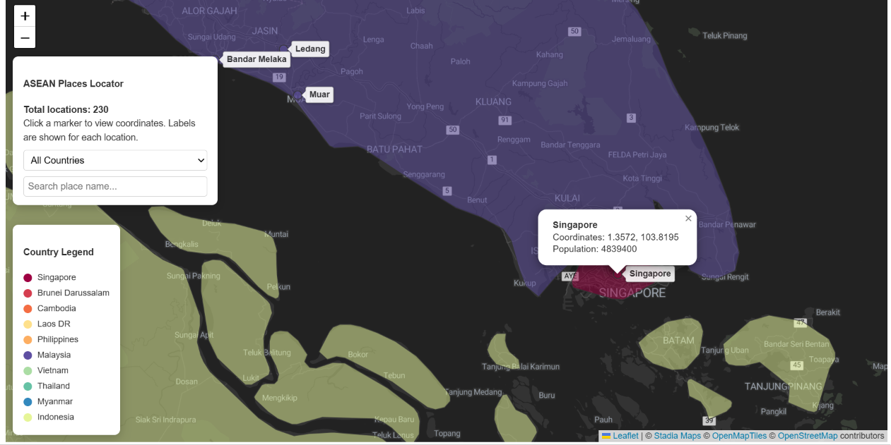

# AGAIF2026_BC1_CA3_MY-564_WONG_YAN_WEN_REPO
A repository for ASEAN GEOAI Bootcamp - Certified Assessment Assignment 3: AI-Assisted Interactive Web Mapping Using Leaflet.js

## Built With
- **Frontend:** HTML, CSS, JavaScript
- **Map Library:** Leaflet.js
- **Data Source:** Open Street Map, ASEAN GEOAI FUSION 2026 Collabhub

## Features

### ✅Simple UI
 

### ✅Search Function
 

### ✅Population info

## Instruction :

### Option 1: View Live on GitHub (Recommended)
You can view the fully functioning web application immediately without downloading any files:
**[Insert live GitHub Pages link here]*

### Option 2: Run Locally from Zip File

1. Download the zip file.
2. Extract the zip file. 
3. Ensure **Visual Studio Code** is downloaded on your computer. 
4. Follow this youtube tutorial to download the relevant extentions: https://youtu.be/mL1IcxIUd5Y?si=B8PBYKDJctqbDXww 
5. Open the `AGAIF2026_BC1_CA3_MY-564_WONG_YAN_WEN` folder in Visual Studio Code. 
6. Right click `index.html`. Click **Open with Live Server**.
7. The web mapping application is ready for use.

